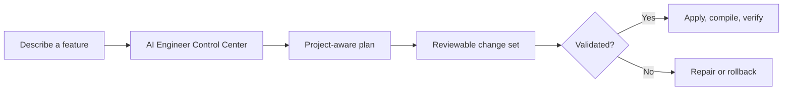

# AI Engineer v0.3.0

> **A local-first AI production workspace for Unity 6.**
> Plan, review, validate, apply, and undo Unity changes from one Control Center.

| Unity | Primary models | Interface | Release |
| --- | --- | --- | --- |
| Unity 6 / 6000.x | `qwen3:30b` + `llava:7b` | Turkish & English | v0.3.0 |



## Build Unity features with safer AI assistance

AI Engineer reads the active scene, existing C# APIs, project assets, and local
Unity documentation before it proposes a change. Instead of allowing raw model
output to write directly into a project, it uses a reviewable change set and a
transactional executor.

### What is included in v0.3.0

| Capability | What it does |
| --- | --- |
| **Gameplay planning** | Produces two-pass plans for bombs, power-ups, chain reactions, effects, audio, and gameplay code. |
| **Project grounding** | Validates real scene paths, public script APIs, asset paths, and component targets. |
| **Safe execution** | Creates a backup, waits for compilation, validates results, and rolls back failed work. |
| **Mobile UI** | Builds landscape or portrait entry UI with reference images, real CTA buttons, and scene/gameplay transitions. |
| **Unity generation** | Creates scripts, GameObjects, components, prefabs, materials, ParticleSystem effects, characters, and prototypes. |
| **Model providers** | Uses local Ollama by default; optional Qwen Code and Codex account workflows are available. |

## Where generated work goes

```text
Assets/
├── AIEngineer/                  # Protected package tooling
└── AIEngineerGenerated/          # Editable generated games, UI, prefabs, effects, characters
```

The autonomous workflow protects the package itself. If a package-owned sample
scene is open, it is copied to `Assets/AIEngineerGenerated` before it is edited.

## Quick start

1. Import the Unity package.
2. Open **AI Engineer → Control Center**.
3. Choose **Create**, **Analyze**, **Repair**, **Games**, or **Memory**.
4. Describe the feature in Turkish or English; optionally select a reference image.
5. Review the plan, then choose **Approve and apply autonomously**.
6. Check compilation and Play Mode results; use **Undo last operation** if needed.

## Documentation

| Document | Purpose |
| --- | --- |
| [v0.3.0 Release Notes](RELEASE_NOTES_v0.3.0.md) | New visual release overview, workflow diagrams, verification, and limitations. |
| [Archived v0.3.0 Notes](Docs/RELEASE_NOTES_v0.3.0.md) | English archive of the original detailed release notes. |
| [Changelog](Docs/CHANGELOG.md) | Release history. |
| [Installation](UnityPackage/INSTALL.md) | Unity package installation. |
| [Another PC Setup](UnityPackage/BASKA_PC_KURULUM.md) | Backend and Unity setup on another computer. |
| [Control Center Guide](UnityPackage/CONTROL_CENTER_KULLANIM_KILAVUZU.md) | Control Center workflow. |
| [Model & Autonomy Guide](UnityPackage/MODEL_VE_OTONOM_KULLANIM.md) | Models, providers, review, and autonomous execution. |

## Verification

```powershell
python -m unittest test_autonomous_change_protocol.py test_package_delivery.py test_phase8_local_operation.py test_phase11_end_to_end.py
```

**v0.3.0 release result:** 55 tests passed.

## Important boundaries

- Local LLaVA analyzes reference images; it does not generate raster images.
- Complex flattened UI images may be used as backgrounds while editable Unity controls are created separately.
- Model plans must pass project, API, scene, and asset validation before they run.
- Qwen Code and Codex account workflows require active CLI sessions.
