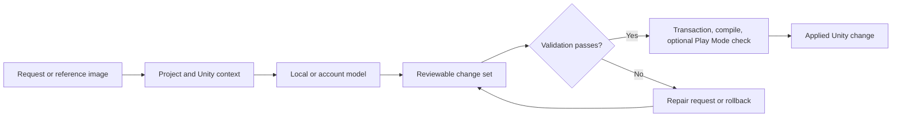
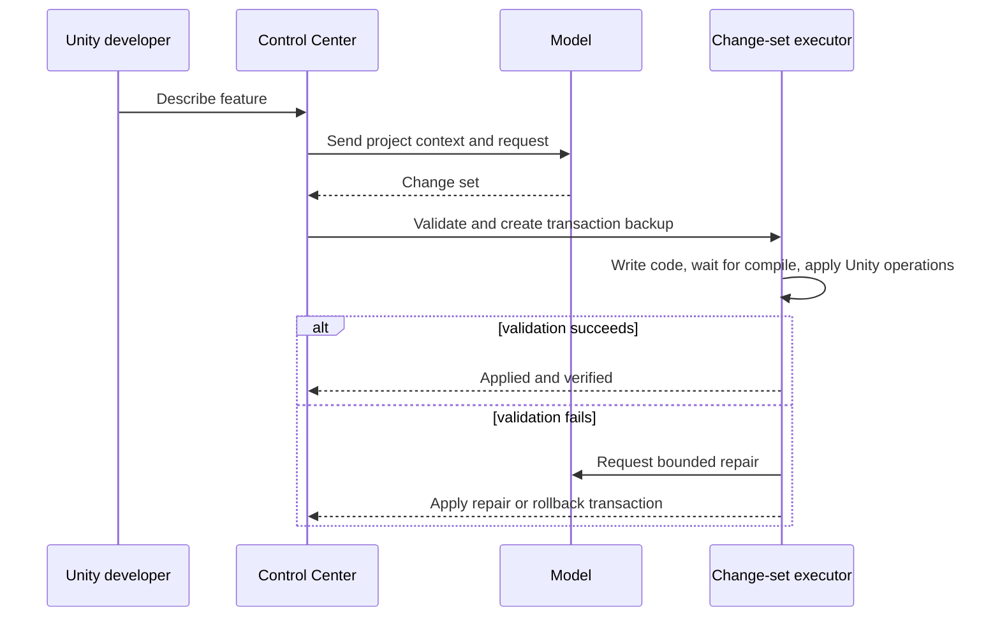

# AI Engineer v0.3.0

> **A local-first, transactional AI workspace for Unity 6.**

| Release date | Target branch | Unity support | Status |
| --- | --- | --- | --- |
| 22 July 2026 | `develop` | Unity 6 / 6000.x | Release candidate |

---

## What this release delivers

AI Engineer v0.3.0 turns a simple command window into a Unity production
workspace that can inspect the active project, scene hierarchy, public C# APIs,
assets, and locally available Unity documentation. It converts requests into a
reviewable change set and applies only operations that pass validation.



## Highlights

| Area | v0.3.0 capability |
| --- | --- |
| **Local intelligence** | `qwen3:30b` for planning/code and `llava:7b` for reference-image analysis. |
| **Gameplay features** | Two-pass planning for bombs, power-ups, projectiles, enemies, chain reactions, sound, effects, and acceptance checks. |
| **Project grounding** | Real scene object paths, existing assets, and public C# APIs are supplied to the planning workflow. |
| **Safe execution** | Transaction backup, compile wait, optional Play Mode validation, bounded repair, and rollback. |
| **Mobile UI** | Landscape/portrait CanvasScaler layouts, selectable image fit, CTA placement, and functional Unity buttons. |
| **Providers** | Local Ollama first, with optional Qwen Code and Codex account workflows. |
| **Generated output** | New games, characters, UI, and prototypes are isolated under `Assets/AIEngineerGenerated`. |

---

## 1. Local model and two-pass gameplay planning

- `qwen3:30b` is supported for text, code, and gameplay planning.
- Local `llava:7b` support is available for reference-image analysis.
- Gameplay requests are processed in two stages:
  1. A feature blueprint identifies behaviour, spawning/distribution, effects,
     audio, existing-system integration, risks, and acceptance checks.
  2. A concrete Unity change set is generated from that blueprint.
- Responses that are incomplete or invalid JSON are rejected before they reach
  the Unity execution layer.

## 2. Project-grounded validation

- The planner receives real GameObject paths from the active scene.
- Public fields and methods from project scripts are summarized as `script_api`
  context.
- Calls to missing APIs are rejected before application.
- `add_component` and `set_property` operations may target only real hierarchy
  objects.
- Missing prefab, audio, material, scene, or asset paths are rejected early.
- A new gameplay `MonoBehaviour` must be connected to a scene or prefab.
- Random gameplay behaviours require their controlling code and effect links.

## 3. Autonomous application and rollback



- File operations, Unity operations, and validation are separate phases.
- After C# changes, Unity compilation is allowed to finish before scene or
  prefab operations continue.
- Play Mode validation can be requested when appropriate.
- Failed repairs restore the transaction backup.
- The latest successful operation can be reverted from Control Center.

## 4. Safe output boundaries

| Protected | Editable generated output |
| --- | --- |
| `Assets/AIEngineer` package source | `Assets/AIEngineerGenerated` |
| Package-owned sample scenes | Cloned, editable game scenes |
| Editor tooling and executor internals | Games, characters, UI, effects, prefabs |

The autonomous workflow cannot modify the AI Engineer package itself. If a
package sample scene is open, it is copied into the editable output area before
changes are applied.

## 5. Mobile UI and reference-image workflow

- The model can choose `rebuild`, `background`, or `hero` reference layouts.
- Images can use `contain` or `cover`; they are not forced into a distorted
  aspect ratio.
- A CTA can use one of nine normalized anchor positions.
- A start CTA is created as an actual Unity `Button`.
- The button can reveal the gameplay root or open a valid Unity scene.
- Existing generated menus can be safely replaced.
- Both landscape and portrait mobile CanvasScaler layouts are supported.

## 6. Unity production capabilities

- Controlled C# creation and text changes
- GameObject creation and serialized component binding
- Prefab and material creation
- ParticleSystem-based effects
- Mobile entry UI generation
- 2D and 3D character prefab generation
- Game prototype and marble-shooter sample generation
- Scene saving, validation, transaction history, and rollback

## 7. Model providers

| Provider | Use case | Notes |
| --- | --- | --- |
| Ollama | Default local operation | Runs without an API key once models are installed. |
| Qwen Code | Optional account workflow | Requires an active Qwen CLI/account session. |
| Codex | Optional account workflow | Requires an active Codex CLI/account session. |

Account-based providers generate reviewable change sets; they are not granted
unrestricted direct file mutation.

---

## Using Control Center

Open **AI Engineer → Control Center** in Unity.

1. Choose a workspace: **Create**, **Analyze**, **Repair**, **Games**, or
   **Memory**.
2. Write the request in English or Turkish.
3. Optionally select a reference image.
4. Choose a local model or an account provider.
5. Create and review the proposed plan.
6. Apply only a plan with correct targets and paths.
7. Review Console, compilation, and Play Mode results.
8. Use **Undo last operation** when needed.

## Installation and upgrade

For a new machine or package installation, read:

- `UnityPackage/INSTALL.md`
- `UnityPackage/BASKA_PC_KURULUM.md`
- `UnityPackage/CONTROL_CENTER_KULLANIM_KILAVUZU.md`
- `UnityPackage/MODEL_VE_OTONOM_KULLANIM.md`

When upgrading from an older version, let Unity finish script compilation.
Existing package-generated games remain intact; new output is created under
`Assets/AIEngineerGenerated`.

## Verification

The release suite validates the change-set protocol, package delivery, local
operation, and the end-to-end workflow:

```powershell
python -m unittest test_autonomous_change_protocol.py test_package_delivery.py test_phase8_local_operation.py test_phase11_end_to_end.py
```

**Result:** 55 tests passed.

The included Python backend archive was also checked for portability:

- 202 source entries
- no `__pycache__` or `.pyc` files
- no local learning history or database files
- no machine-specific project paths or credentials

## Known limitations

- Not every model-generated gameplay feature is applicable. It must pass the
  real project API, scene target, and asset validations.
- Complex, flattened raster UI images cannot always be separated into fully
  editable layers. In that case, the image is used as a background while Unity
  controls are created separately.
- Raster image generation requires a configured image provider. Local LLaVA
  analyzes images; it does not generate them.
- Qwen Code and Codex account workflows require their respective CLI sessions.
- Play Mode validation does not mathematically prove every game mechanic;
  scene-specific acceptance checks may still be required.

## Not included in GitHub or the backend archive

- The full offline Unity documentation archive
- Ollama model files
- Qwen Code installation and account data
- Unity `Library`, `Temp`, `Logs`, and `UserSettings` directories
- Local indexes, databases, and learning history
- Machine-specific `ai_config.json` paths and provider credentials
- Python `__pycache__` / `.pyc` artifacts
- Temporary test and inspection output

These resources should be recreated or installed separately on another
computer.
