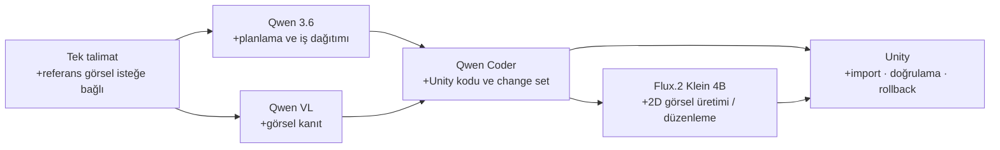

# AI Engineer v0.3.1 — Görsel Varlık Üretimi

> Yerel AI uzmanları artık tek bir Unity isteği altında birlikte çalışır.

## Öne çıkanlar

### Tek istek, otomatik uzman yönlendirmesi

Control Center artık model veya araç düğmeleriyle iş bölmez. Kullanıcı tek bir niyet yazar; sistem planlama, görsel analiz, C# üretimi ve 2D varlık üretimi gereken yerde ilgili yerel uzmana yönlendirir.

Örnek:

> “Bu referans görselden sarı bir karakter Sprite'ı üret, prefab oluştur ve hareket kodunu ekle.”

### Flux.2 Klein 4B entegrasyonu

- `generate_image` change-set işlemi eklendi.
- ComfyUI üzerinden metinden görsel ve referans görselden düzenleme desteklenir.
- Çıktılar yalnızca `Assets/AIEngineerGenerated/` altında PNG olarak yazılır.
- Unity çıktıyı otomatik içe aktarır; istenirse Sprite importer uygular.
- Üretim öncesi snapshot alınır; hata halinde transaction rollback çalışır.

### Referans görsel deneyimi

- Her tür ekran görüntüsü, fotoğraf veya konsept görsel kullanılabilir.
- Sürükle-bırak, dosya seçme ve Windows panosundan Ctrl+V desteklenir.
- Referans proje içine güvenli, benzersiz bir kopya olarak alınır.
- Vision modeli ilk yüklenirken oluşabilecek yanlış zaman aşımı için süre artırıldı.

### Daha temiz Control Center

- Oluştur / Analiz / Onar ana akışı sadeleştirildi.
- Oyunlar ve Hafıza ana ekrandan kaldırıldı.
- Tek sütunlu, daha sıkı düzen ve vurgulu ana eylem düğmesi eklendi.
- Teknik sağlayıcı ayarları ana üretim akışından çıkarıldı.

## Model rolleri

| Rol | Yerel model | Sorumluluk |
| --- | --- | --- |
| Orkestrasyon | Qwen 3.6 35B | Niyeti parçalar ve uzmanlara iş devreder |
| Kod | Qwen3 Coder 30B | Unity C# ve uygulanabilir change set üretir |
| Görsel analiz | Qwen3 VL 30B | Referans görselden kanıt çıkarır |
| 2D görsel | Flux.2 Klein 4B | Sprite / konsept üretir ve düzenler |

## Doğrulama

- Python regresyonları: **45/45 geçti**.
- `generate_image` için hedef-yol, PNG, boyut, Sprite import ve rollback korumaları test edildi.
- Unity Control Center derleme hataları düzeltildi; layout Begin/End dengesi kontrol edildi.

## Kurulum notu

ComfyUI çalışma zamanı, Python sanal ortamı ve model ağırlıkları depo dışında tutulur. `Tools/Workflows` altındaki iki API workflow şablonu sürüm kontrolündedir; yerel ComfyUI kurulumu bu şablonları kullanmalıdır.
